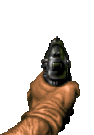

# Build Your Own Doom-Style 2.5D Game in Canvas + JavaScript

A step-by-step tutorial that takes you from a minimal raycaster to a playable Doom-like game with textured walls, enemies, a gun, sound, and player damage. Each stage builds on the previous one so you can follow along and end up with working HTML files you can open in a browser.

**What you'll build:** A classic "2.5D" first-person view: the world is actually 2D (a top-down grid), but we draw it with raycasting so it looks like 3D corridors. We add sprites for enemies, a weapon, and audio to make it feel like a tiny Doom.

**Files per stage:** After each section you'll have a single HTML file (and any assets it references). The tutorial uses these names. The repo includes pre-built versions of each stage with these filenames so you can run and compare:

| Stage | File | What you add |
|-------|------|--------------|
| 1 | `stage_01_basic_walls.html` | Canvas, map, rays, wall height, simple lighting |
| 2 | `stage_02_movement_minimap.html` | Smooth movement, minimap |
| 3 | `stage_03_textured_walls.html` | Wall texture from image |
| 4 | `stage_04_enemy_sprites.html` | Enemy sprites, AI, melee |
| 5 | `stage_05_animated_enemies.html` | Idle / attack / dead animations |
| 6 | `stage_06_gun_shooting.html` | Gun overlay, shooting, ray-hit damage |
| 7 | `stage_07_sound_effects.html` | Pistol and death sounds |
| 8 | `stage_08_player_damage.html` | Player HP, damage flash, death screen |

---

## Prerequisites

- A text editor and a modern browser (Chrome, Firefox, Edge).
- For stages 3–8 you'll need asset files in the same folder as the HTML (or adjust paths): `wall.png`, `doom_sprites.png`, `gun-idle-small.png`, `gun-shooting-small.gif`, and a `sounds/` folder with WAV files (see stage 7).

---

# Stage 1: Basic 2.5D Walls with Lighting

**Goal:** One HTML file that draws a 2D grid as vertical "walls" on a canvas, with a sky/floor and distance-based shading. You can turn and walk with the arrow keys.

**Why this order:** Raycasting is the core of Doom-style rendering. We get that working first with the simplest possible map and no textures.

## 1.1 The idea: raycasting

The world is a 2D grid (e.g. `"1"` = wall, `"0"` = empty). The player has a position `(px, py)` and a view angle `pa`. For each column of the screen we shoot a ray in the direction of that column. When the ray hits a wall, we know the distance. From that we compute how tall the wall should be on screen (closer = taller) and how dark (farther = darker).

So we need:

1. A **map** (array of strings).
2. **Player state**: `px`, `py`, `pa` (angle in radians).
3. A **field of view** (e.g. 60° = π/3).
4. For each screen column: **cast a ray** until it hits a wall, then **draw one vertical strip** of the correct height and shade.

## 1.2 Canvas and map

Start with a single file: one `<canvas>` and one `<script>`.

```html
<canvas id="c" width="400" height="250"></canvas>
<script>
const ctx = c.getContext("2d");

const map = [
  "11111111",
  "10000001",
  "10000001",
  "10000001",
  "10000001",
  "11111111"
];

let px = 3.5, py = 3.5, pa = 0;
const fov = Math.PI / 3;
</script>
```

- **Map:** Rows of strings; `map[row][col]`: `"1"` = wall, `"0"` = walkable. Player starts in the center of a small room.
- **Player:** `px`, `py` in "tile units" (e.g. 3.5 = middle of tile 3), `pa` = view angle (0 = right, π/2 = down).
- **FOV:** Total angle we see; π/3 ≈ 60° is a common choice.

## 1.3 Wall check

We need to know if a world position is inside a wall. Map coordinates are in "tile space"; we floor them to get the tile index.

```javascript
function isWall(x, y) {
  const mx = Math.floor(x), my = Math.floor(y);
  return map[my]?.[mx] === "1";
}
```

Using `map[my]?.[mx]` avoids out-of-bounds errors for rays that go past the map.

## 1.4 Drawing one frame: sky, floor, then rays

Each frame we clear the canvas, draw sky (top half) and floor (bottom half), then for each screen column we cast a ray and draw one vertical strip.

```javascript
function draw() {
  ctx.clearRect(0, 0, c.width, c.height);

  // Sky and floor (no 3D yet)
  ctx.fillStyle = "#87ceeb";
  ctx.fillRect(0, 0, c.width, c.height / 2);
  ctx.fillStyle = "#444";
  ctx.fillRect(0, c.height / 2, c.width, c.height / 2);

  for (let x = 0; x < c.width; x++) {
    const rayAngle = pa - fov / 2 + (x / c.width) * fov;
    let dist = 0;
    while (dist < 20) {
      const rx = px + Math.cos(rayAngle) * dist;
      const ry = py + Math.sin(rayAngle) * dist;
      if (isWall(rx, ry)) break;
      dist += 0.02;
    }

    const corrected = dist * Math.cos(rayAngle - pa);
    const wallHeight = Math.min(c.height, 300 / corrected);

    const shade = Math.max(0, 255 - corrected * 40);
    ctx.fillStyle = `rgb(${shade},${shade},${shade})`;
    ctx.fillRect(x, (c.height - wallHeight) / 2, 1, wallHeight);
  }

  requestAnimationFrame(draw);
}
```

**Ray angle:** For column `x` we want the ray to spread from `pa - fov/2` to `pa + fov/2`, so: `rayAngle = pa - fov/2 + (x / c.width) * fov`.

**Ray march:** We step the ray at small increments (0.02) from the player until we hit a wall or exceed max distance (20).

**Fisheye correction:** Raw distance would make walls at the sides look too tall. Multiply by `Math.cos(rayAngle - pa)` so only the distance "straight ahead" counts. That gives correct perspective.

**Wall height:** Closer walls should be taller. A simple formula: `wallHeight = constant / correctedDist`. We cap with `Math.min(c.height, ...)` so it doesn’t explode when the player is very close. The wall is centered vertically: `(c.height - wallHeight) / 2`.

**Shading:** Farther = darker. `shade = 255 - corrected * 40`, clamped to 0. So each strip is a 1px-wide gray rectangle.

## 1.5 Input: turn and move

On keydown we change angle or position. Movement uses the current angle; we only move if the new position is not a wall.

```javascript
addEventListener("keydown", e => {
  if (e.key === "ArrowLeft") pa -= 0.1;
  if (e.key === "ArrowRight") pa += 0.1;
  if (e.key === "ArrowUp") {
    const nx = px + Math.cos(pa) * 0.1;
    const ny = py + Math.sin(pa) * 0.1;
    if (!isWall(nx, ny)) px = nx, py = ny;
  }
  if (e.key === "ArrowDown") {
    const nx = px - Math.cos(pa) * 0.1;
    const ny = py - Math.sin(pa) * 0.1;
    if (!isWall(nx, ny)) px = nx, py = ny;
  }
});

draw();
```

**Design choice:** We check only the exact point `(nx, ny)`. Later we’ll use a small radius so the player doesn’t clip into walls.

**Summary of Stage 1:** We introduced the **map** (2D grid of "1"/"0"), **player** (`px`, `py`, `pa`), **ray marching** (step until `isWall`), **fisheye correction** (`dist * cos(rayAngle - pa)`), **wall height** (`constant / correctedDist`), **distance shading** (darker = farther), and **keydown movement** (arrow keys). No delta time yet—movement is per key press.

Save this as **stage_01_basic_walls.html** and open it. You should see a gray room, turn with left/right and move with up/down.

---

# Stage 2: Smooth Movement and a Minimap

**Goal:** Movement that feels smooth (key-held, frame-based), a proper game loop with delta time, and a minimap in the corner showing the 2D map and player.

**Why:** Discrete keydown steps feel choppy. Holding a key should move every frame. A minimap helps with orientation and debugging.

## 2.1 Key state instead of keydown-only

We need to know "is this key currently held?" so we can move every frame while W is down.

```javascript
const keys = {};
addEventListener("keydown", e => keys[e.key.toLowerCase()] = true);
addEventListener("keyup", e => keys[e.key.toLowerCase()] = false);
```

Use `keys["w"]`, `keys["a"]`, etc. in the game loop.

## 2.2 Player object and movement constants

Centralize player and tuning in one place:

```javascript
const player = {
  x: 1.5,
  y: 1.5,
  angle: 0,
  moveSpeed: 0.045,
  rotSpeed: 0.035
};
```

Movement per frame will be `moveSpeed` or `rotSpeed` (possibly scaled by delta time later).

## 2.3 Separate X and Y collision (sliding)

If we only check the final `(nx, ny)` we get stuck on corners. A common trick: move in X and Y independently so we slide along walls.

```javascript
function tryMove(nx, ny) {
  if (!isWall(nx, player.y)) player.x = nx;
  if (!isWall(player.x, ny)) player.y = ny;
}
```

So we accept the new X if the column is free, and the new Y if the row is free. That gives smooth sliding.

## 2.4 Update player from key state

Each frame we read keys and apply rotation and movement:

```javascript
function updatePlayer() {
  if (keys["a"]) player.angle -= player.rotSpeed;
  if (keys["d"]) player.angle += player.rotSpeed;

  const cos = Math.cos(player.angle);
  const sin = Math.sin(player.angle);

  if (keys["w"]) {
    tryMove(
      player.x + cos * player.moveSpeed,
      player.y + sin * player.moveSpeed
    );
  }
  if (keys["s"]) {
    tryMove(
      player.x - cos * player.moveSpeed,
      player.y - sin * player.moveSpeed
    );
  }
  // Optional: strafe with Q/E (angle ± 90°)
  if (keys["q"]) {
    tryMove(
      player.x + Math.cos(player.angle - Math.PI / 2) * player.moveSpeed,
      player.y + Math.sin(player.angle - Math.PI / 2) * player.moveSpeed
    );
  }
  if (keys["e"]) {
    tryMove(
      player.x + Math.cos(player.angle + Math.PI / 2) * player.moveSpeed,
      player.y + Math.sin(player.angle + Math.PI / 2) * player.moveSpeed
    );
  }
}
```

## 2.5 Raycast that returns hit info

For the minimap we’ll want to draw rays. So we turn the ray loop into a function that returns distance and hit position:

```javascript
function castRay(rayAngle) {
  const stepSize = 0.01;
  let dist = 0;
  let hitX = 0, hitY = 0;

  while (dist < MAX_DEPTH) {
    hitX = player.x + Math.cos(rayAngle) * dist;
    hitY = player.y + Math.sin(rayAngle) * dist;
    if (isWall(hitX, hitY)) {
      const cellX = hitX % 1, cellY = hitY % 1;
      const edge = Math.min(cellX, 1 - cellX, cellY, 1 - cellY);
      return { dist, hitX, hitY, edge };
    }
    dist += stepSize;
  }
  return { dist: MAX_DEPTH, hitX, hitY, edge: 0.5 };
}
```

We also compute `edge` (distance to the tile boundary) so we can darken wall edges a bit when drawing (optional).

## 2.6 3D view using castRay

The main view now uses `castRay` and uses the returned distance for height and brightness, and optionally uses `edge` for edge darkening:

```javascript
const ray = castRay(rayAngle);
const correctedDist = ray.dist * Math.cos(rayAngle - player.angle);
const wallHeight = Math.min(H, H / Math.max(correctedDist, 0.0001));
let brightness = 255 - correctedDist * 16;
if (ray.edge < 0.03) brightness *= 0.7;
brightness = Math.max(20, Math.min(255, brightness));
ctx.fillStyle = `rgb(${brightness},${brightness},${brightness})`;
ctx.fillRect(x, (H - wallHeight) / 2, 2, wallHeight);
```

Drawing in strips of 2 pixels (`x += 2`) is a simple optimization; we’ll keep that for later stages.

## 2.7 Minimap

Draw the 2D map in a corner, then the player as a dot and a short line for facing, then optionally a few rays:

```javascript
function drawMinimap() {
  const scale = 18, pad = 10;

  ctx.fillStyle = "rgba(0,0,0,0.55)";
  ctx.fillRect(pad - 4, pad - 4, MAP_W * scale + 8, MAP_H * scale + 8);

  for (let y = 0; y < MAP_H; y++) {
    for (let x = 0; x < MAP_W; x++) {
      ctx.fillStyle = map[y][x] === "1" ? "#cfcfcf" : "#222";
      ctx.fillRect(pad + x * scale, pad + y * scale, scale - 1, scale - 1);
    }
  }

  const px = pad + player.x * scale;
  const py = pad + player.y * scale;
  ctx.fillStyle = "red";
  ctx.beginPath();
  ctx.arc(px, py, 4, 0, Math.PI * 2);
  ctx.fill();
  ctx.strokeStyle = "red";
  ctx.beginPath();
  ctx.moveTo(px, py);
  ctx.lineTo(px + Math.cos(player.angle) * 16, py + Math.sin(player.angle) * 16);
  ctx.stroke();
}
```

**Scale:** World coords are in "tiles"; multiply by `scale` to get minimap pixels. So `player.x * scale` gives the X position on the minimap.

**Loop order:** Call `updatePlayer()`, then `draw3D()`, then `drawMinimap()`, then `requestAnimationFrame(loop)`.

**Summary of Stage 2:** We added **key state** (`keys` object + keydown/keyup), **player object** with `moveSpeed`/`rotSpeed`, **sliding collision** (`tryMove` updates X and Y separately), **strafe** (Q/E with angle ± π/2), **castRay()** returning `{ dist, hitX, hitY, edge }` for reuse, and the **minimap** (scaled grid + player dot + facing line). The game loop still runs at full speed without delta time; the next stages introduce `dt` for consistency.

Save as **stage_02_movement_minimap.html**. You now have smooth W/A/S/D (and Q/E strafe) and a minimap.

---

# Stage 3: Textured Walls

**Goal:** Use an image (e.g. `wall.png`) to draw the walls instead of flat gray. Each vertical strip samples one column of the texture based on where the ray hit the wall.

**Why:** Textures give the world a recognizable look and make it feel more like classic Doom.

## 3.1 Load the wall texture

```javascript
const wallTexture = new Image();
wallTexture.src = "wall.png";
```

Always check `wallTexture.complete` (and optionally `naturalWidth > 0`) before drawing with it, so we don’t draw before the image loads.

## 3.2 Texture coordinate from hit position

When the ray hits a wall, we’re at position `(hitX, hitY)` inside a tile. The fractional part tells us where we hit:

- **Hit a vertical tile edge** (left/right of the cell): the run along the wall is in the Y direction → use `cellY` (fractional Y) as the texture coordinate.
- **Hit a horizontal tile edge** (top/bottom): use `cellX` (fractional X).

So we decide "vertical edge" with a small threshold on `cellX` and then pick either `cellY` or `cellX` as `texX` in 0..1:

```javascript
if (isWall(hitX, hitY)) {
  const cellX = hitX % 1, cellY = hitY % 1;
  const hitVertical = cellX < 0.02 || cellX > 0.98;
  const texCoord = hitVertical ? cellY : cellX;
  return { dist, hitX, hitY, texX: texCoord };
}
```

We’ll use `texX` to pick which column of the texture to sample.

## 3.3 Draw one wall strip from the texture

For each ray we already have `wallHeight` and the top of the wall. We take one column from the texture and stretch it to the strip:

```javascript
if (wallTexture.complete) {
  const texX = Math.floor(ray.texX * wallTexture.width);
  ctx.drawImage(
    wallTexture,
    texX, 0, 1, wallTexture.height,   // source: one column
    x, wallTop, 2, wallHeight           // destination: screen strip
  );
  const shade = Math.min(0.8, correctedDist / 10);
  ctx.fillStyle = `rgba(0,0,0,${shade})`;
  ctx.fillRect(x, wallTop, 2, wallHeight);
}
```

- **Source:** One pixel column from the texture: `(texX, 0, 1, wallTexture.height)`.
- **Destination:** The vertical strip on screen: `(x, wallTop, 2, wallHeight)`. The browser scales the column to the strip height.
- **Distance shading:** A semi-transparent black overlay makes farther walls darker; `shade` increases with distance and is capped (e.g. 0.8).

## 3.4 Fallback when texture isn’t loaded

If the image isn’t ready, fall back to the gray strip so the game still runs:

```javascript
} else {
  const brightness = Math.max(40, 255 - correctedDist * 18) | 0;
  ctx.fillStyle = `rgb(${brightness},${brightness},${brightness})`;
  ctx.fillRect(x, wallTop, 2, wallHeight);
}
```

**Texture coordinate choice:** Using the fractional part of the hit position (`cellX` or `cellY`) gives a consistent mapping: the same wall strip always samples the same part of the texture. The threshold `0.02` / `0.98` distinguishes "hit vertical edge" vs "hit horizontal edge" so we pick the correct axis for the texture run.

**Summary of Stage 3:** We added **wall texture** loading (`new Image()`, `wallTexture.src`), **tex coord from hit** (`hitVertical ? cellY : cellX`), **drawImage** with a 1-pixel-wide source column scaled to the wall strip, **distance overlay** (`rgba(0,0,0, shade)`), and a **fallback** to gray when the texture isn’t loaded. The rest of the engine (rays, movement, minimap) is unchanged.

Put the texture file `wall.png` next to the HTML (or fix the path). Save as **stage_03_textured_walls.html**. You now have textured walls with distance darkening.

---

# Stage 4: Enemy Sprites

**Goal:** Add enemies as sprites in the world: they appear as 2D images that always face the camera, move with simple AI (wander or chase), and can be hit with a melee (e.g. SPACE). We need depth so sprites draw behind/in front of walls and each other.

**Why:** Sprites are how Doom drew monsters: one image per angle or a single "billboard" that faces the player. We use the same idea with a sprite sheet and a depth buffer.

## 4.1 Sprite sheet and enemy definitions

Load a sprite sheet that contains enemy images (e.g. `doom_sprites.png`). Define each enemy type with a rectangle in that sheet and some stats:

```javascript
const spriteSheet = new Image();
spriteSheet.src = "doom_sprites.png";

const ENEMY_SPRITES = {
  zombie: { x: 76, y: 72, w: 39, h: 55, scale: 0.95, speed: 0.012, hp: 30 },
  imp:    { x: 261, y: 72, w: 44, h: 55, scale: 1.05, speed: 0.015, hp: 40 },
  // ... more types
};
```

`x, y, w, h` are the pixel rectangle in the sheet; `scale` adjusts size on screen; `speed` and `hp` for movement and health.

## 4.2 Depth buffer

Rays give us the distance to the wall for each screen column. We store that so when we draw sprites we can skip columns where the wall is in front:

```javascript
const STRIP_WIDTH = 2;
const NUM_RAYS = W / STRIP_WIDTH;
const depthBuffer = new Array(NUM_RAYS).fill(MAX_DEPTH);
```

When we cast rays in `draw3D()`, we set:

```javascript
depthBuffer[rayIndex] = correctedDist;
```

Later, for each sprite column we check `if (sprite.transformY >= depthBuffer[rayIndex]) continue;` so we don’t draw sprite pixels where the wall is closer.

## 4.3 Enemy list and spawn

Each enemy is an object with world position, type, and state:

```javascript
const enemies = [];
let enemyId = 1;

function makeEnemy(type, x, y) {
  const def = ENEMY_SPRITES[type];
  return {
    id: enemyId++,
    type, x, y,
    radius: 0.22,
    speed: def.speed,
    scale: def.scale,
    hp: def.hp,
    wanderAngle: Math.random() * Math.PI * 2,
    wanderTimer: 0.5 + Math.random() * 1.5,
    hurtFlash: 0
  };
}

function spawnEnemies() {
  enemies.length = 0;
  const spawnList = [ ["zombie", 5.5, 2.5], ["imp", 8.5, 3.5], /* ... */ ];
  for (const [type, x, y] of spawnList) {
    if (isPositionFree(x, y, 0.2)) enemies.push(makeEnemy(type, x, y));
  }
}
```

`isPositionFree` checks the four corners of a square around `(x, y)` with the given padding so we don’t spawn inside walls. Use the same idea for the player with `player.radius`.

## 4.4 Player radius and isPositionFree

Treat the player as a circle of radius `player.radius`:

```javascript
function isPositionFree(x, y, padding = 0.18) {
  return !isWall(x - padding, y - padding)
      && !isWall(x + padding, y - padding)
      && !isWall(x - padding, y + padding)
      && !isWall(x + padding, y + padding);
}
```

Use `player.radius` when calling `tryMove` so we don’t slide into walls.

## 4.5 Sprite transform (world → screen)

To draw a sprite we need to project world position `(enemy.x, enemy.y)` to screen X and size. Classic approach:

1. Relative to player: `dx = enemy.x - player.x`, `dy = enemy.y - player.y`.
2. Transform to "camera space" using the camera plane (perpendicular to view direction):
   - `dirX = cos(angle)`, `dirY = sin(angle)`
   - `planeX = -dirY * tan(FOV/2)`, `planeY = dirX * tan(FOV/2)`
   - `invDet = 1 / (planeX*dirY - dirX*planeY)`
   - `transformX = invDet * (dirY*dx - dirX*dy)`
   - `transformY = invDet * (-planeY*dx + planeX*dy)`
3. If `transformY <= 0` the sprite is behind us; skip. Otherwise:
   - `screenX = (W/2) * (1 + transformX/transformY)`
   - `spriteHeight = (H / transformY) * scale` (and width from aspect ratio).

So we get a screen X, a height, and we draw the sprite centered at `screenX` with that height. We also keep `transformY` for depth (smaller = farther).

## 4.6 Collect and sort sprites, then draw by strip

- For each enemy, compute `screenX`, `drawY`, `spriteWidth`, `spriteHeight`, `transformY`, and push into `visibleSprites`.
- Sort by distance (or `transformY`) **back to front** so we draw far sprites first, then near ones on top.
- For each sprite, loop over screen columns it covers. For each column, check the depth buffer: if the wall is closer (`sprite.transformY >= depthBuffer[rayIndex]`), skip. Otherwise sample the sprite sheet (one column per screen column) and draw that strip. Optionally apply a distance shade or a red `hurtFlash` overlay.

Pseudocode:

```javascript
visibleSprites.sort((a, b) => b.dist - a.dist);
for (const sprite of visibleSprites) {
  for (let screenX = startX; screenX < endX; screenX += STRIP_WIDTH) {
    const rayIndex = Math.floor(screenX / STRIP_WIDTH);
    if (sprite.transformY >= depthBuffer[rayIndex]) continue;
    const texRatio = (screenX - sprite.drawX) / sprite.spriteWidth;
    const srcX = sprite.spriteDef.x + Math.floor(texRatio * sprite.spriteDef.w);
    ctx.drawImage(spriteSheet, srcX, sprite.spriteDef.y, 1, sprite.spriteDef.h,
                  screenX, sprite.drawY, STRIP_WIDTH, sprite.spriteHeight);
    // optional: distance shade, hurtFlash
  }
}
```

## 4.7 AI: wander and chase

Each frame for each enemy:

- If `seesPlayer` (distance < 8 and `hasLineOfSight(enemy, player)`): set move angle toward player, optionally move faster.
- Else: decrement a wander timer; when it hits 0, pick a new random `wanderAngle` and reset the timer.

Move the enemy by that angle and speed. Use `isPositionFree` and a check that the enemy doesn’t overlap the player or other enemies (e.g. `distance(nx, ny, other.x, other.y) >= radius+other.radius`).

**Line of sight:** Step from enemy to player in small steps; if any step is inside a wall, there’s no LOS. That way enemies don’t shoot or chase through walls.

## 4.8 Melee hit (SPACE)

On SPACE: find the closest enemy that is in range (e.g. 1.5 tiles), within a narrow angle in front of the player, and with LOS. Apply damage (e.g. 20) and set `hurtFlash = 1`. Remove enemies with `hp <= 0` (or mark them dead and keep them for a death animation in the next stage).

**Why depth buffer:** In a real 3D engine you’d use a depth buffer for every pixel. Here we only have one depth value per column (from the raycast). So we draw sprites **column by column**: for each column we compare the sprite’s distance (`transformY`) to `depthBuffer[rayIndex]`. If the wall is closer, we skip that column. That gives correct occlusion of sprites by walls in a raycasting engine.

**Summary of Stage 4:** We added **depthBuffer** (one value per ray), **enemy list** and **spawn** with `isPositionFree`, **sprite transform** (camera plane math → `screenX`, `spriteHeight`), **back-to-front sort** by distance, **strip drawing** with depth test and texture column sampling, **AI** (wander timer + chase when `seesPlayer` + LOS), **hasLineOfSight** (stepping along the segment), **player radius** and **isPositionFree** for collision, and **melee** (SPACE: closest in-range, in-cone, LOS enemy takes damage). Enemies are billboard sprites that always face the camera.

Save as **stage_04_enemy_sprites.html**. You now have textured walls, moving sprites that hide behind walls, and melee combat.

---

# Stage 5: Animated Enemies (Idle / Attack / Dead)

**Goal:** Each enemy has multiple frames: idle (walk), attack, and dead. We drive which frame is shown with a simple state machine and timers so we get walking, attacking, and death animations.

**Why:** Static sprites look dull; even two-frame idle and a death frame make the world feel much more alive.

## 5.1 Enemy definition with frames

Instead of one rectangle per type, we store several rectangles per state (idle, attack, dead):

```javascript
const ENEMY_DEFS = {
  enemy: {
    hp: 40,
    speed: 0.014,
    radius: 0.24,
    scale: 1.0,
    frames: {
      idle:   [ { x: 64, y: 0,  w: 64, h: 64 }, { x: 64, y: 64, w: 64, h: 64 } ],
      attack: [ { x: 64, y: 64, w: 64, h: 64 } ],
      dead:   [ { x: 64, y: 128, w: 64, h: 64 } ]
    }
  }
};

const ANIM_DURATIONS = {
  idle: 400,
  attack: 180,
  dead: 999999
};
```

Idle has two frames (alternating walk); attack and dead can be one or more. Durations are in milliseconds per frame.

## 5.2 Per-enemy state and animation

Each enemy gets a state and frame index:

```javascript
function makeEnemy(type, x, y) {
  const def = ENEMY_DEFS[type];
  return {
    // ... position, type, hp, etc. ...
    state: "idle",
    animTime: 0,
    animFrameIndex: 0,
    attackCooldown: 0
  };
}
```

- **state:** `"idle"` | `"attack"` | `"dead"`.
- **animTime:** Accumulated time in the current frame (ms).
- **animFrameIndex:** Which frame of the current state we’re on.

## 5.3 State machine in updateEnemies

- If `enemy.hp <= 0`: set `state = "dead"`, run only the animation update, no movement. Optionally keep dead enemies in the list and draw the dead frame.
- Else:
  - If enemy sees player and is close: set `state = "attack"`, set `attackCooldown` when you want an "attack" moment (e.g. play sound or deal damage in a later stage).
  - If seeing player but not in attack range: move toward player, keep `state = "idle"`.
  - If not seeing player: wander, `state = "idle"`.
- After movement, call `updateEnemyAnimation(enemy, dtMs)`.

## 5.4 updateEnemyAnimation

```javascript
function updateEnemyAnimation(enemy, dtMs) {
  const def = ENEMY_DEFS[enemy.type];
  const frames = def.frames[enemy.state] || def.frames.idle;
  const duration = ANIM_DURATIONS[enemy.state] || 400;
  if (frames.length <= 1) return;
  enemy.animTime += dtMs;
  while (enemy.animTime >= duration) {
    enemy.animTime -= duration;
    enemy.animFrameIndex = (enemy.animFrameIndex + 1) % frames.length;
  }
}
```

So we advance the frame index when `animTime` exceeds the per-frame duration. For dead we use a long duration so we effectively stay on one frame.

## 5.5 Drawing the current frame

When building the sprite draw list, use the current state and frame:

```javascript
const frames = def.frames[enemy.state] || def.frames.idle;
const frame = frames[enemy.animFrameIndex % frames.length];
```

Then use `frame.w`, `frame.h`, `frame.x`, `frame.y` for sampling the sprite sheet (same strip-by-strip draw as stage 4).

## 5.6 Delta time in the loop

Use elapsed time so animation and movement are frame-rate independent:

```javascript
let lastTime = performance.now();
function loop(now) {
  const dt = Math.min(0.033, (now - lastTime) / 1000);
  lastTime = now;
  // ...
  updatePlayer(dt);
  updateEnemies(dt);
  // ...
}
```

Scale movement by `dt * 60` (or similar) so speed is "per second" and pass `dt * 1000` as `dtMs` to the animation updater.

**Why a state machine:** Idle, attack, and dead have different frame counts and timings. Keeping a `state` and selecting `frames[enemy.state]` keeps the logic clear and makes it easy to add more states (e.g. pain, different attacks) later. The same `updateEnemyAnimation` works for all states; we only change which array of frames we use.

**Summary of Stage 5:** We replaced single-rect enemy defs with **ENEMY_DEFS** that have **frames** per state (`idle`, `attack`, `dead`) and **ANIM_DURATIONS** in ms. Each enemy has **state**, **animTime**, **animFrameIndex**, and **attackCooldown**. **updateEnemyAnimation** advances the frame index when `animTime` exceeds the per-frame duration. The **draw** path uses `def.frames[enemy.state]` and `frames[enemy.animFrameIndex]` to sample the correct sprite rectangle. We also introduced **delta time** in the loop (`dt`, `lastTime`) so movement and animation are frame-rate independent. Dead enemies stay in the list and keep drawing the dead frame.

Save as **stage_05_animated_enemies.html**. Enemies should walk (idle), switch to attack when close, and show a dead frame when killed.

---

# Stage 6: Gun and Shooting

**Goal:** A visible gun at the bottom of the screen (idle image, switching to a shooting GIF when firing) and SPACE triggering a ray-style shot that damages the closest enemy in view. No new 3D geometry—the gun is a 2D overlay.

**Why:** The gun gives clear feedback and makes combat feel like Doom; using the same "ray + angle + LOS" idea as melee but with longer range and a clear visual/audio cue.

## 6.1 Gun images and DOM overlay

Use an `` overlay so the gun can be an animated GIF (e.g. muzzle flash) without drawing each frame in canvas:

```html
<canvas id="game" width="960" height="600"></canvas>

```

```javascript
const gunOverlayEl = document.getElementById("gun-overlay");
const gunIdleSrc = "gun-idle-small.png";
const gunShootSrc = "gun-shooting-small.gif";
```

We’ll swap `gunOverlayEl.src` to the shooting GIF when the player fires, then back to idle after a short time.

## 6.2 Gun state

```javascript
const GUN_FIRE_TIME = 0.5;
let gunIsShooting = false;
let gunFireTimer = 0;
```

When the player presses fire: set `gunIsShooting = true`, `gunFireTimer = GUN_FIRE_TIME`, and set the overlay `src` to `gunShootSrc`. In the loop, decrement `gunFireTimer`; when it hits 0, set `gunIsShooting = false` and overlay back to `gunIdleSrc`. Block another shot while `gunIsShooting` is true so the animation can play.

## 6.3 Positioning the gun (layoutGunOverlay)

Each frame, position the `` so it sits at the bottom center of the canvas, just above the HUD bar. Use the canvas’s position on the page so it still lines up if the canvas is centered:

```javascript
function layoutGunOverlay() {
  if (!gunOverlayEl) return;
  const baseW = gunOverlayEl.naturalWidth || 64;
  const baseH = gunOverlayEl.naturalHeight || 64;
  const hudTop = H - 110;
  const x = canvas.offsetLeft + (W - baseW) / 2;
  const y = canvas.offsetTop + hudTop - baseH + 18;
  gunOverlayEl.style.position = "absolute";
  gunOverlayEl.style.pointerEvents = "none";
  gunOverlayEl.style.width = baseW + "px";
  gunOverlayEl.style.height = baseH + "px";
  gunOverlayEl.style.left = Math.round(x) + "px";
  gunOverlayEl.style.top = Math.round(y) + "px";
}
```

Call `layoutGunOverlay()` every frame after drawing the canvas so the gun stays aligned.

## 6.4 tryGunShot (ray-style hit)

When the player fires (and not already shooting):

1. Start the gun animation and timer as above.
2. Find the best target: among enemies with `hp > 0`, in range (e.g. 12), within a narrow cone in front of the player (e.g. `maxAngle = 0.16`), and with LOS. Pick the **closest** such enemy.
3. Apply damage (e.g. 20), set `hurtFlash = 1`. If HP goes to 0, set `state = "dead"` and reset animation.

Same idea as melee but with longer range and tighter cone. No physical projectile—instant hit.

## 6.5 HUD

Draw a status bar at the bottom (background + border) and text like "Weapon: Pistol", "SPACE shoot", and enemy count. The gun image sits above this bar.

**Why a DOM overlay for the gun:** The gun animation can be an animated GIF (muzzle flash, recoil). GIFs play on their own; if we drew them on the canvas we’d have to decode and blit each frame. Using an `` and swapping `src` to a shooting GIF lets the browser handle the animation. We position it with CSS so it sits over the canvas. The only downside is keeping it in sync with canvas size/position (hence `layoutGunOverlay` each frame).

**Summary of Stage 6:** We added a **gun overlay** `` and **gun state** (`gunIsShooting`, `gunFireTimer`, `GUN_FIRE_TIME`). **layoutGunOverlay()** positions the image at the bottom center of the canvas using `canvas.offsetLeft/offsetTop`. **tryGunShot()** starts the shooting animation and timer, swaps the image to the shooting GIF, and performs a **ray-style hit** (closest in-range, in-cone, LOS enemy takes damage). The main loop decrements the timer and switches back to idle image when done. Melee can be removed or kept; the tutorial version uses the gun for damage. HUD shows "Weapon: Pistol" and "SPACE shoot".

Save as **stage_06_gun_shooting.html**. You should see the gun, hear nothing yet, and be able to shoot enemies with SPACE and see the shooting GIF.

---

# Stage 7: Sound Effects

**Goal:** Play a pistol sound when the player shoots and an enemy death sound when an enemy is killed. Use the Web Audio API or simple `Audio` elements.

**Why:** Sound strongly sells the feel of shooting and killing; even two sounds make a big difference.

## 7.1 Load sounds

Put WAV (or MP3) files in a `sounds/` folder and preload them:

```javascript
const pistolSound = new Audio("sounds/pistol13.wav");
pistolSound.volume = 0.8;

const deathSound = new Audio("sounds/death.wav");
deathSound.volume = 0.8;
```

(Paths can be relative to the HTML file.)

## 7.2 Play on shoot

Inside `tryGunShot()`, after starting the gun animation:

```javascript
try {
  pistolSound.currentTime = 0;
  pistolSound.play();
} catch (e) { /* autoplay restrictions */ }
```

Resetting `currentTime` lets the same sound play again if the user fires quickly.

## 7.3 Play on enemy death

When you apply damage and the enemy’s HP drops to 0:

```javascript
if (best.hp <= 0) {
  best.state = "dead";
  best.animFrameIndex = 0;
  best.animTime = 0;
  try {
    deathSound.currentTime = 0;
    deathSound.play();
  } catch (e) {}
}
```

Browsers often require a user gesture before playing audio; the first shot or keypress usually satisfies that. WAV is widely supported; use MP3 or OGG if you need smaller files.

**Summary of Stage 7:** We added **Audio** objects for **pistol** and **death** sounds, with **volume** set. In **tryGunShot()** we call `pistolSound.currentTime = 0; pistolSound.play()` when the player fires. When an enemy is killed we call `deathSound.currentTime = 0; deathSound.play()`. Wrapping in try/catch avoids errors from autoplay policies. No other game logic changes—this stage is purely additive.

Save as **stage_07_sound_effects.html**. You now have shooting and death sounds.

---

# Stage 8: Player Damage and Death

**Goal:** The player has hit points. Enemies can damage the player when in attack state (e.g. ray or instant hit when attack cooldown fires). When the player is hit: reduce HP, show a red screen flash, play an injury sound. When HP reaches 0: show a "DEAD" screen, stop movement and shooting, play a death sound. Optionally hide the gun when dead.

**Why:** This completes the loop: enemies are a threat, and the game has a clear lose condition.

## 8.1 Player HP and death flag

```javascript
const player = {
  // ...
  hp: 100
};
let playerDead = false;
let damageFlash = 0;  // 0..1, red overlay when > 0
```

## 8.2 Enemy attack damages player

In `updateEnemies`, when an enemy is in attack state and its attack cooldown triggers (e.g. `attackCooldown === 0`), resolve the hit:

- Check LOS from enemy to player again (in case the player moved).
- If clear: `player.hp = Math.max(0, player.hp - 15)`, set `damageFlash = 1`, play an injury sound. If `player.hp === 0` and not already dead: set `playerDead = true`, play player death sound.
- Set `enemy.attackCooldown = 0.8` (or similar) so attacks are spaced.

Use separate Audio objects for injury and player death so you can play the right one.

## 8.3 Block input when dead

In `updatePlayer`, return immediately if `playerDead`. In the fire key handler, return if `playerDead` so the player can’t shoot after death.

## 8.4 Damage flash overlay

Each frame after drawing the world and HUD, if `damageFlash > 0`, draw a semi-transparent red fullscreen rect:

```javascript
function drawDamageFlash(dt) {
  if (damageFlash <= 0) return;
  ctx.fillStyle = `rgba(180, 0, 0, ${damageFlash * 0.6})`;
  ctx.fillRect(0, 0, W, H);
}
```

Then decay: `damageFlash = Math.max(0, damageFlash - dt * 2.5);` so the flash fades over a few frames.

## 8.5 Death screen

If `playerDead`, draw a fullscreen dark red and big "D E A D" text:

```javascript
function drawDeathScreen() {
  if (!playerDead) return;
  ctx.fillStyle = "rgba(140, 0, 0, 0.92)";
  ctx.fillRect(0, 0, W, H);
  ctx.fillStyle = "#ffe5e5";
  ctx.font = "72px monospace";
  ctx.textAlign = "center";
  ctx.textBaseline = "middle";
  ctx.fillText("D E A D", W / 2, H / 2);
  ctx.textAlign = "start";
  ctx.textBaseline = "alphabetic";
}
```

Call this last so it’s on top of everything.

## 8.6 Hide gun when dead

In `layoutGunOverlay()`, if `playerDead`, set `gunOverlayEl.style.display = "none"`; else `"block"`. So the gun disappears when the player dies.

## 8.7 HUD health

In the status bar text, show: `Health: ${player.hp}` so the player can see how much damage they’ve taken.

**Enemy attack resolution:** When an enemy enters attack state and its cooldown fires, we check LOS again (player might have moved). If the shot "hits", we reduce `player.hp`, trigger `damageFlash` and injury sound, and if HP hits 0 we set `playerDead` and play the death sound. The enemy’s attack cooldown is reset so they don’t deal damage every frame. This gives a simple but clear "enemy shoots at you" feel without projectiles.

**Summary of Stage 8:** We added **player.hp** (e.g. 100), **playerDead** flag, and **damageFlash** (0..1). **updateEnemies** now resolves **enemy attacks**: when attack cooldown triggers, LOS check to player → if hit, subtract HP, set damageFlash, play injury sound; if HP becomes 0, set playerDead and play death sound. **updatePlayer** and fire handler **return early** when playerDead. We draw **drawDamageFlash()** (red overlay that fades) and **drawDeathScreen()** ("D E A D" fullscreen). **layoutGunOverlay** hides the gun when dead. HUD shows **Health**. Extra sounds: injury, player death, and (optionally) enemy pistol so the player can tell when they’re being shot at.

Save as **stage_08_player_damage.html**. You now have a full loop: shoot enemies, take damage from them, see and hear feedback, and get a game over when HP reaches 0.

---

# Summary

You went from a minimal raycaster to a small Doom-like game by adding:

1. **Raycasting** – Map as grid, rays for each column, distance → height and shade.
2. **Smooth movement** – Key state, sliding collision, minimap.
3. **Textures** – One texture column per ray from hit position.
4. **Sprites** – Depth buffer, transform world→screen, sort and draw strips with depth test; enemies with simple AI and melee.
5. **Animation** – State machine (idle/attack/dead) and frame timers.
6. **Gun** – DOM overlay, idle/shoot images, ray-style shot.
7. **Sound** – Pistol and death (and later injury/player death).
8. **Player damage** – HP, damage flash, death screen, enemy attacks hurting the player.

You can extend from here: more levels, more weapons, different enemy types, pickups, or a proper game loop with menus and restart. Have fun building your tiny Doom.
